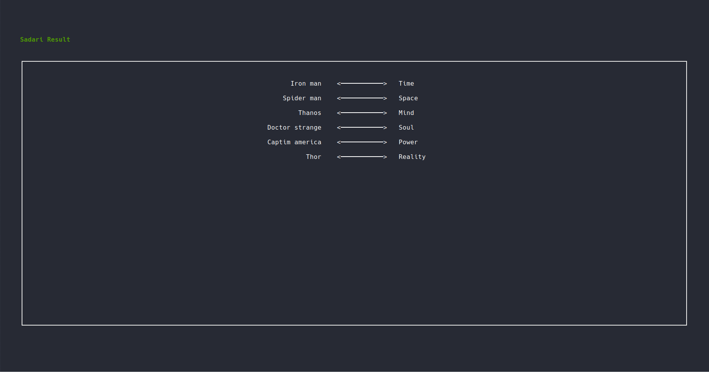

# 🍺 rust-sadari-cli

`rust-sadari-cli` is sadari game (ghost leg in another words) based on terminal. Check more info [here!](https://en.wikipedia.org/wiki/Ghost_Leg)

> Generally, it is used to do lottery game to find random pairs of two sets.

### Demo


#### main page


#### result page


-------------

### 🎴 How to use?

#### Run with file path!
```
$ cargo run ./text.txt
```

In `text.txt` file... (two lines of texts separated by comma)
```
Iron man, Spider man, Thanos, Doctor strange, Captim america, Thor
    Soul,       Time, Space,            Mind,        Reality, Power
```

#### Just Run! rust-sadari will ask several questions to you!

```
$ cargo run
```

It will ask you some inputs like this!

```
Type list of names separated by comma! ex) name1, name2, name3 ...

	Q,q) Quit

$ type:

```


